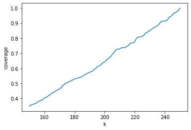
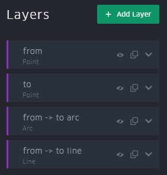

# ChargingParkPlacement
ChargingParkPlacement contains three heuristics **Pruning**, **Peak Node Mapping(PNM)** and **Park Extending** for computing k-Threshold-Shortest-Path Covers (**k-SPC**s), which cover all shortest path with at least k length in graph. 
These covers can be used for suggesting new electric vehicle charging parks. For the Contraction Hieararchies used in **PNM** the library [RoutingKit](https://github.com/RoutingKit/RoutingKit) was used.

## Setup and Installation
RoutingKit requires zlib to work. Under Debian and derived distributions (such as Ubuntu) you can install them using: 
```
sudo apt-get install zlib1g-dev
```
After that you can install RoutingKit with:
```
git clone https://github.com/RoutingKit/RoutingKit.git
cd RoutingKit
make
```
We also require [Boost](https://www.boost.org/) to be installed, which can be done using:
```
sudo apt-get install libboost-all-dev
```
This project uses cmake. If not installed, it can be installed using:
```
sudo apt-get install cmake
```
### RoutingKit include and libraray files
Create two files **routingkit_include.txt** and **routingkit_lib.txt** in *ChargingParkPlacement/*. After that write the relative path to the lib and include folder of RoutingKit into them. For example if you installed RoutingKit in the same directory as ChargingParkPlacement you would have the following two files.

\> routingkit_include.txt
```
../RoutingKit/include
```
\> routingkit_lib.txt
```
../RoutingKit/lib
```


## Graphs
A contracted version of the highway network graphs for Germany, Spain and Europe are already included in the data folder, each consisting of a *\<graph\>_nodes.csv* and a *\<graph\>_arcs_.csv*. By default only these graphs can be used. You can set the graph using the -c parameter
```
./ParkPlacing -c germany ...
```

If you want to use different graphs you can load them directly as *pbf*-file, which can be downloaded at [Geofabrik](https://download.geofabrik.de/). To extract the highway network the tool [osmosis](https://github.com/openstreetmap/osmosis) can be used:
```
osmosis --read-pbf <graph>-latest.osm.pbf --tf accept-ways highway=motorway,motorway_link --tf reject-relations --used-node --write-pbf <graph>_motorways.pbf
```
After that you can use the *precompute_graph* function in */src/main.cpp* to load the pbf file and export the contracted grpah.

## Documentation
We now provide some examples on how to use the heuristics Pruning, Park Extending and PNM.
If you want to extend the existing IONITY or Tesla charging network you can either add the parameter **--ionity**(**-i**) or **--tesla**(**-t**). If the cover should be validated after the computation add **--validate**(**-v**).
### Pruning:
```
./ParkPlacement -k 250 -c germany --heuristic pruning -o pruning250.csv
```
### Peak Node Mapping (PNM)
```
./ParkPlacement -k 250 -c germany --heuristic pnm -o pnm250.csv
```
### Park Extending
Park Extending has a second parameter *min_dist*. You can either provide a value for *min_dist* (Default 0.5) or add the parameter **--random** (**-r**) which starts multiple iterations with randomizes *min_dist* values to find a small cover. By default this search for a best cover does not stop, but you can use **--max_time** to set a maximum time. Also note that if you don't extend an existing charging park network with (**-i** or **-o**) a random node is chosen and added to the cover at the start of Park Extending, from which the start extending the cover. So even when providing a value for *min_dist* the behaviour is non-deterministic.

```
./ParkPlacement -k 250 -c germany --heuristic park_extending --min_dist 0.564 -o park_extending250.csv
```
This starts Park Extending without existing charging parks and with a *min_dist* value of 0.564.
```
./ParkPlacement -k 250 -c germany --heuristic park_extending --random --max_time 60 -o park_extending250.csv
```
Here Park Extending is started with **--random** set and **--max_time** set to 60 minutes. Hence, Park Extending tries to find the smallest cover by trying different values for *min_dist* in a time frame of 60 minutes. If a new best cover is found, it is exported to the output location, so the search can be stopped earlier without loosing the current result.

## Coverage Analysis
For a produced cover we can compute *turning_points* indicating for each edge, the maximum length of an uncovered shortest path using this edge.
```
./ParkPlacement -c germany --turningpoints <cover>.csv -o turning_points.csv
```
After that we can use *analysis/coverage_quality.ipynb* to compute a graph of the coverage quality.
 

## Visualization
The produced covers are exported as csv-files. With [Kepler](https://kepler.gl/demo) we can simply visualize them, by adding the csv as dataset, which automatically creates a Point layer.


We can also visualize the computed *turning_points* for a cover. We, therefore, add the according csv-file to Kepler. This creates the following layers.


<br clear="left"/>
We delete the first three layers and make the last visible. We then switch to the filter tab and create a new filter for the csv-field flag. We can now change the lower value of the slider. The remaining edges all belong to uncovered shortest paths with at least the length of this value.

